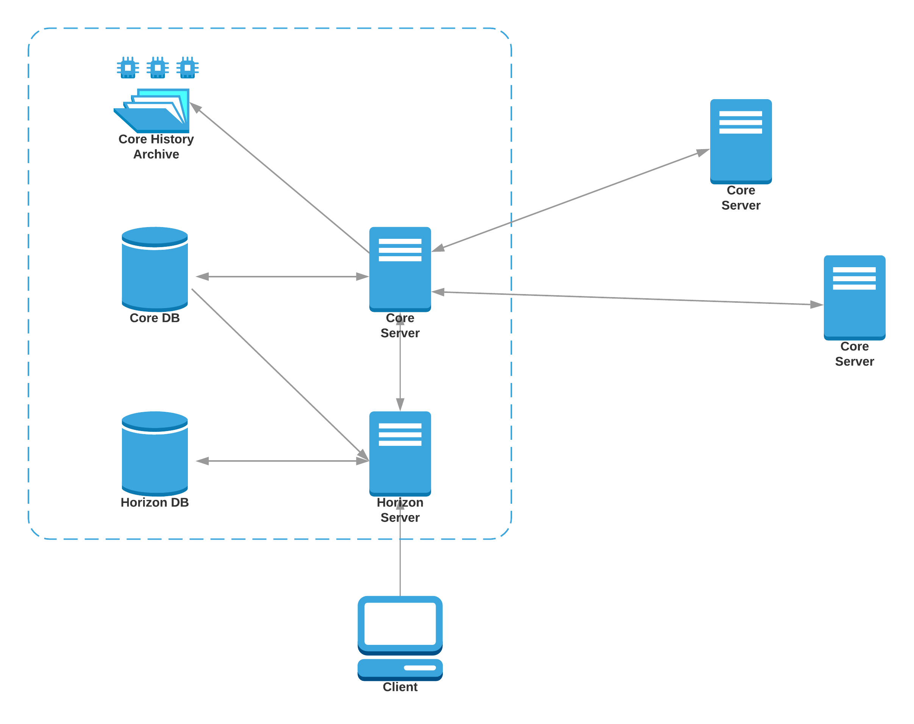

# Kin Federation Nodes

This folder contains documentation related to setting up and maintaining a ***BASIC*** Kin blockchain federation node containing both Core and Horizon, more complicated network topologies might be used as neccessary.

The basic form of a federation node consists of the following:

## Federation Node Components

### Core Server 

Core is the backbone of the Kin network. It maintains a local copy of the ledger, communicating and staying in sync with other instances of Core on the network. It also store historical records of the ledger and participate in consensus.

#### Required Hardware Requirements

A c5.4xlarge AWS machine or equivalent with 20 GB Magnetic storage.

** IMPORTANT NOTE: As the number of transactions on the Kin blockchain expected to grow, and as we continue to add security features and customize to Kin Core and Kin Horizon, hardware requirements are subject to change.

#### Network Connections

Core should be allowed to connect the following components:
1. Core DB - outbound for read & write
1. Other Core machines - outbound and inbound for read & write
1. Core History Archive - outbound for write

#### Health and Monitoring

Core should be monitored for:
1. 4xx and 5xx errors
1. Other blockchain specific metrics
    1. History archive publish rate
    1. Latest block age
    1. Quorum health (how many nodes are synced)

### Core DB

Core maintains the current state of the ledger in a SQL DB. Currently the recommendation is to use Postgress, though it can be configured to use either sqlite or postgres.

This database is the main way a dependent service such as Horizon can gather information on the current ledger state or transaction history.

#### Required Hardware Requirements

A db.m4.xlarge AWS RDS machine or equivalent with 100 GB Magnetic storage.

### Core History Archive

Core normally interacts with one or more “history archives” which are configurable facilities for storing and retrieving flat files containing history checkpoints: bucket files and history logs. History archives are usually off-site commodity storage services such as Amazon S3, Google Cloud Storage, Azure Blob Storage, or custom SCP/SFTP/HTTP servers.

### Horizon Server

Horizon is the client-facing API server for the Kin ecosystem. It acts as the interface between Core and applications that want to access the Kin network. Horizon allows you to submit transactions to the network, check the status of accounts, and subscribe to event streams.

#### Required Hardware Requirements

A c5.large AWS machine or equivalent with 20 GB Magnetic storage.

#### Network Connections

Horizon should be allowed to connect the following components:
1. Horizon DB - outbound for read & write
1. Core DB - outbound for read
1. Core Server - outbound for read
1. HTTP/S - inbound for client connections

#### Health and Monitoring

Horizon should be monitored for:
1. 4xx and 5xx errors
1. Attached Core health at http://xxxxx:11626/info
1. HTTP calls response time by end point and method

#### Horizon DB

Horizon is dependent upon a PostgreSQL server, which it uses to store processed core data for ease of use.

#### Required Hardware Requirements

A db.m4.xlarge AWS RDS machine or equivalent with 100 GB Magnetic storage.

## Federation Node Set Up Process

### Configuration and Initialization

#### Configuring and Initializing Core

Please refer [Kin Core Ansible file](../deploy/ansible/playbooks/roles/stellar-core/tasks/main.yml) for the steps required for configure and initialize Kin Core, this Ansible file makes use of [Kin Core docker file](../images/dockerfiles/Dockerfile.stellar-core) to clone, build and configure Kin Core

TBD - how to fetch core configuration from known cores

TBD - how to configure quorum

#### Configuring and Initializing Horizon

Please refer [Kin Horizon Ansible file](../deploy/ansible/playbooks/roles/horizon-start/tasks/main.yml) for the steps required for configure and initialize Kin Horizon, this Ansible file makes use of [Kin Horizon build docker file](../images/dockerfiles/Dockerfile.horizon-build) and [Kin Horizon bin docker file](../images/dockerfiles/Dockerfile.horizon-bin) to clone, build and configure Kin Core

## Federation Node Ongoing

### Security Requirements

Please follow [this security guide](../SECURITY.md)

### Availability Requirements / SLA

Validators are expected to provide high availability for their node of 99% uptime.